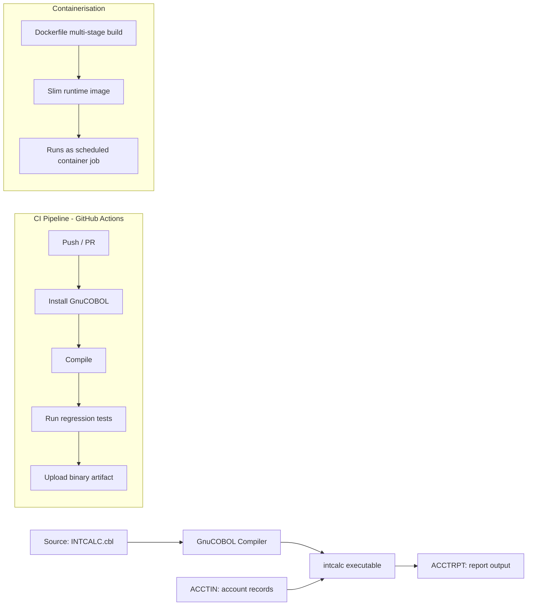

[](https://github.com/meshachleudin/cobol-cicd-pipeline/actions/workflows/ci.yml)

# COBOL CI/CD Pipeline — Mainframe Batch Job Modernisation


A small but complete demonstration of applying modern DevOps practices
(automated testing, CI, containerisation) to a traditional COBOL batch
job — the kind of program you'd find running nightly on a mainframe in
a bank or insurer.

## Why this project exists

Most COBOL still in production was never built with automated testing
or CI/CD in mind — changes are tested manually and promoted through
environments by hand. This project shows one way to bring that
workload under the same engineering discipline used for any other
service: version control, automated regression tests, a CI pipeline,
and a portable container image.

## What the program does

`INTCALC.cbl` is a simple but realistic batch job:

- Reads a fixed-width sequential file of account records (account ID,
  account type, balance)
- Applies a different interest rate depending on account type
  (Savings / Current / Deposit) using `EVALUATE` and `88-level`
  condition names, the same pattern used throughout real COBOL
  codebases
- Produces an edited, formatted report with per-account detail lines
  and control totals — mirroring a typical end-of-day mainframe report

## Architecture



## Project structure

```
cobol-cicd-pipeline/
├── src/
│   └── INTCALC.cbl          COBOL source
├── tests/
│   ├── sample_accounts.txt  Sample input data
│   ├── expected_output.txt  Known-good baseline output
│   └── run_tests.sh         Compiles, runs, and diffs against baseline
├── .github/workflows/
│   └── ci.yml                GitHub Actions pipeline
├── Dockerfile                Multi-stage container build
└── README.md
```

## Running it locally

Requires [GnuCOBOL](https://gnucobol.sourceforge.io/) (`gnucobol4` on
Ubuntu/Debian).

```bash
cobc -x -o intcalc src/INTCALC.cbl
cp tests/sample_accounts.txt ACCTIN
./intcalc
cat ACCTRPT
```

## Running the test suite

```bash
chmod +x tests/run_tests.sh
./tests/run_tests.sh
```

This compiles the program fresh, runs it against the sample dataset,
and diffs the result against a known-good baseline — a lightweight
regression test pattern that catches unintended changes in business
logic, the same risk teams manage when promoting COBOL changes between
environments.

## Running in Docker

```bash
docker build -t intcalc-job .
docker run --rm intcalc-job
```

## Possible extensions

- [ ] Add a second job type (e.g. overdraft fee calculation) to show
      multi-program JCL-style orchestration
- [ ] Add a GitHub Actions matrix testing against multiple GnuCOBOL
      versions
- [ ] Publish the image to GitHub Container Registry on tagged release

## Background

Written as part of a portfolio demonstrating the transition from
mainframe development into DevOps practice — applying CI/CD,
containerisation, and automated testing to legacy COBOL/JCL workloads.
